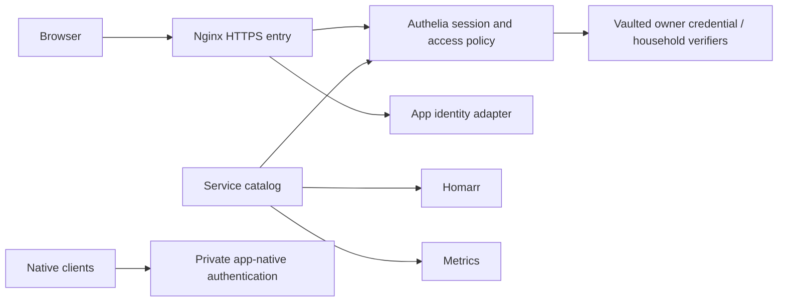

# Shared authentication standard

## Rollout status — 2026-09-16

**Enabled in production across all 35 registered HTTPS browser apps.**
The central owner login is saved/read-verified as **Home Server — auth** in the
owner-authorized 1Password Employee vault, at `https://auth.home.egouda.xyz`.
Normal form fields advertise `autocomplete=username` and `current-password`.
The browser visibly detects 1Password; automatic suggestion/filling still requires
confirmation in the owner's extension session. If its menu is absent, unlock the
Chrome extension and use Command-Backslash to select the saved login.

Verified: real owner login and shared session across 35 apps; anonymous and forged
identity-header rejection; secure HttpOnly cookies; server-side logout; Mariam's
household policy allows media routes and denies owner-only apps. The file-backed
password-verifier import was checked against a real known Jellyfin verifier and an
isolated login fixture. Mariam's own interactive sign-in remains a household check.

Application checks passed for Jellyfin/Requests, qBittorrent/Sonarr/Radarr/Prowlarr,
Grafana live data, whiteboard boards/MCP/WebSockets, Footage, Life Dashboard and
Coach. Mac network and server health checks passed. Life Dashboard now explicitly
accepts its HTTPS browser origin for edits while rejecting unrelated origins.

An encrypted **central-auth-only** backup was restored and its SQLite database
verified on September 16 (`scripts/backup-auth-to-mac.py`). The larger scheduled
configuration backup remains constrained by Mac disk space; this small snapshot
does not replace it.

## Contract for every application

- Browser entry point: registered HTTPS URL under `home.egouda.xyz`.
- Identity provider: self-hosted Authelia at `https://auth.home.egouda.xyz`.
- Browser credentials: normal HTML sign-in compatible with password-manager autofill.
- Authorization: explicit `auth` entry in `config/services.json`; owner-only by default.
- Unknown apps fail closed. A route is not ready merely because its container runs.
- No HTTP Basic prompts. NZBGet's upstream Basic credential stays in a private
  Nginx include and is supplied only behind authenticated, owner-only access.
- App sessions and app roles remain separate from gateway authorization. A gateway
  cannot create an application's native session by itself.
- New custom services must use the trusted gateway identity and must not implement their
  own password database. Existing apps use supported OIDC or trusted-header adapters
  when available; otherwise their native form remains behind the gateway.
- Never disable an app's native auth unless its backend is isolated and its identity
  adapter is tested. Never implement password replay or browser cookie scraping.

Each service declares:

```json
"auth": {"mode": "gateway", "access": "owner", "adapter": "gateway"}
```

`access` is `owner` or `household`. `adapter` describes the application integration:
`gateway` for apps relying on the gateway; `native` for existing application forms;
`trusted-header` or `oidc` only after that integration is actually configured/tested.
These labels are not a claim that native SSO has already been deployed.

## Household accounts and native clients

`egouda` belongs to `owners` and `household`. `mgouda` belongs only to `household`.
Mariam's existing Jellyfin PBKDF2 verifier can be imported without knowing her
password. The conversion is tested against an independently computed fixture and
the known owner verifier before import. Do not grant her administrator access.
This is an initial verifier import, **not continuous password synchronization**.
Central password changes and Jellyfin native password changes remain separate until
an app-supported identity integration is deployed.

Jellyfin and Home Assistant native clients cannot complete a browser gateway flow.
Their existing private `.lan` and direct-LAN entry points retain application-native
authentication. Browser links in Homarr use the protected HTTPS entry point. No
header-presence bypass is used. APIs between containers retain their native API keys
and Docker endpoints; do not redirect machine integrations through browser login.
SMB, SSH, DNS and background workers are protocols/services, not browser login pages.

## Deployment and rollback

1. On the Mac, run `prepare-security-credentials.py --service auth --url
   https://auth.home.egouda.xyz`; approve the 1Password desktop prompt. The helper
   saves, reads back, and privately stages the credential before deployment.
2. Sync the auth compose, templates, catalog and helper scripts to the server.
3. Run `python3 scripts/prepare-auth.py` on the server. It creates private keys,
   file-backed user verifiers and the policy; validates configuration; then starts
   the pinned Authelia container without changing app proxies.
4. Run `python3 scripts/configure-auth-proxies.py`. It snapshots touched config
   outside Git, validates Nginx, reloads, and performs real sign-in/anonymous/spoof/
   logout checks against every registered HTTPS app. A failed check restores the
   previous configuration. Applied credentials are recorded only after success.
5. Test actual app functionality, browser autofill, Mariam's household access,
   denied admin access, uploads, whiteboard WebSockets and native media clients.
   Maintenance checks use `auth_session.AuthSession`; keep that shared client
   when adding authenticated tests. Run `make check-network` on the Mac and `make check-server`
   on the server, then make an encrypted recovery snapshot.

Private rollback snapshots live under
`~/.local/state/home-server-maintenance/auth/<timestamp>/`. Restore exactly the
files in `manifest.json`; remove only newly created files marked absent, validate
Nginx and reload. Do not restore unrelated concurrent application files. Keep SSH
available throughout rollout. Authelia failure must deny protected requests.

Secrets/config are under `~/.config/home-server/secrets/authelia`, mode restricted;
SQLite state lives on SSD `/srv/mergerfs/ssd/authelia`. Back up both together.
In-memory gateway sessions are lost on Authelia restart. Password-reset/change UI
is initially disabled; changes must go through the vaulted maintenance flow.
Gateway policy is initially one-factor; Cloudflare's separately enabled MFA does
not make this gateway MFA-protected. Enroll and test a second factor before requiring it.

## New app checklist enforced by registration

`register-service.py` defaults to owner-only gateway access. `--sync` prepares
central policy, applies it, tests every route, then updates Homarr and metrics.
The HTTPS generator invokes the same compiler once central auth is installed.
Every proxy location overwrites identity headers; do not trust headers supplied by
clients or expose a trusted-header backend directly. Any new proxy generator must
use this compiler before publishing a route.



References: [Authelia Nginx integration](https://www.authelia.com/integration/proxies/nginx/),
[session configuration](https://www.authelia.com/configuration/session/introduction/),
[supported password verifiers](https://www.authelia.com/reference/guides/passwords/).

## Operational lessons

Authelia 4.39.27 attempts to create a healthcheck file on its root filesystem.
With a read-only container, disable that generated healthcheck in server settings
and use the explicit Docker HTTP healthcheck in `compose.auth.yml`. Preparation
waits for container health before any proxy rollout. A failed first rollout
exercised the proxy rollback path successfully.

Proxy configuration is read through Docker so root-owned files remain accessible
to the maintenance script. The private NZBGet credential include stays mode 600;
non-secret proxy snippets are mode 644. A route root may perform a harmless local
redirect before Nginx's access phase; auth checks follow only same-host redirects
and require the destination to reach central sign-in.

Policy changes recreate Authelia only when its generated configuration changes;
ordinary repeated preparation does not discard sessions. Sessions use in-memory
storage, so a real policy restart will require sign-in again.
