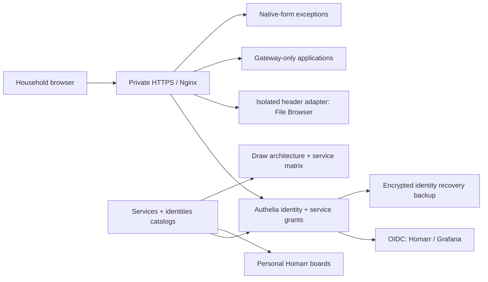

# Household identity and application sign-in

## Current state — September 16, 2026

Authelia is the shared identity provider at `https://auth.home.egouda.xyz`.
Use **Home Server — auth** in 1Password. Every registered HTTPS app has central
access control. This does **not** mean every app has native single sign-on.

| Application | App sign-in | Verification |
|---|---|---|
| Homarr | OIDC, automatic redirect | One central credential opens existing owner account/boards |
| Grafana | OIDC, automatic redirect | One central credential opens existing administrator and dashboard |
| Local Drive / File Browser | Trusted `Remote-User` | One central credential opens existing owner; forged identity overwritten |
| Draw, Life, Footage, Coach and gateway-only tools | Gateway identity | No additional application login configured; Coach trusts the owner header only on an isolated proxy network |
| qBittorrent, Sonarr and NZBGet | Private upstream credential bridge | Central sign-in injects the distinct native recovery credential server-side; it never reaches the browser |
| Jellyfin | OIDC through pinned Community SSO plugin | Central-only sign-in tested at `/sso/OID/start/authelia`; existing profiles and native TV login preserved |
| Vue, Requests and other `native` catalog entries | Application-native session | Native SSO remains work in progress |

The distinction matters: a `200` response containing a login form is not proof
of application sign-in. Run `check-homarr-sso.py`, `check-metrics-sso.py` and
`check-files-sso.py` and `check-jellyfin-sso.py` to prove native identities using **only** the central password.
`check-auth.py` checks gateway authorization separately. `check-coach.py` and
`check-download-logins.py` prove the seamless adapters through their final HTTPS
addresses while retaining native recovery credentials where applicable.

Run `python3 scripts/report-auth-experience.py` for the current human-facing
inventory. A `native` entry deliberately means a second application login still
exists. The report separates native credentials already saved in 1Password from
legacy apps that still need migration, so gateway coverage is never mistaken for
single sign-on.

## Household identities and least privilege

`config/identities.json` is the non-secret source of truth:

- `egouda`: owner; all registered services.
- `mgouda`: Homarr, Jellyfin, Vue, Requests. No owner/admin tools or file storage
  access is implicitly granted.
- New users: no wildcard grants, no owner role from the enrollment helper.

`auth.access: household` means a service is eligible for explicit household grants,
not that all household accounts can open it. Authelia authorizes `owners` OR that
service's `service:<id>` group. OIDC clients enforce the same policy. The base
`household` group itself grants nothing. Unknown routes fail closed.

Homarr accounts link to **stable OIDC subject identifiers**, provisioned explicitly;
automatic email/credentials account linking is disabled after the owner migration.
Grafana's temporary email-matching migration setting is also disabled. Its existing
OAuth account mapping retains owner ID 1 and administrator permissions.

`provision-homarr-identities.py` creates private, read-only personal home boards
containing only granted services. The owner's board/layout remains separate. It
reconciles generated household boards, so customize the owner board freely but
change household tiles through the entitlement catalog.

Mariam's Jellyfin ID, password verifier and Jellyseerr ID/permissions are preserved.
`check-household-identities.py` verifies these and her Homarr permissions. It does
not claim to have entered Mariam's password or tested her personal interactive flow.

## Enroll a future household member

Use the owner-only [People console](people.md) for a 24-hour, single-use private
invitation. The new person sets their own password; the same enrollment helper
below provisions the central and supported native accounts. The CLI remains an
operator recovery path.

Run on the server in an interactive terminal, not in chat:

```sh
ssh -t home-server
cd ~/workspace/home-server
python3 scripts/enroll-household-user.py USERNAME --name 'Display name' \
  --services homarr,jellyfin,vue,requests
```

The password prompt is hidden and requires confirmation. The helper refuses existing
identities; it is **not** a password-reset or migration tool. It creates an ordinary
Jellyfin profile, optionally imports that specific ID into Requests, creates the
central verifier, applies explicit grants and provisions the private Homarr board.
Requests uses its configured default permissions; review those before enrolling.
No new real household account was created while building this helper.

For file storage, include `files` explicitly. A dedicated
`/srv/mergerfs/ssd/creative/People/USERNAME` folder is created, with the File Browser
user restricted to `Creative/People/USERNAME`; no admin, command execution or public
sharing permission. File Browser's unused native password is random, not a shared
household secret. Do not grant `files` by editing JSON alone before provisioning
its isolated native profile.

Store the person's central login in their chosen password manager. Commit/sync only
the non-secret identities catalog to both checkouts. Native and central Jellyfin
passwords start equal for newly enrolled users, but **later password changes are
not synchronized**. Existing Mariam enrollment imported her verifier without
learning her password. Native clients remain explicitly separate until supported
identity integration is verified.

If enrollment stops partway through, investigate the named profile before retrying;
the helper deliberately refuses overwriting partially provisioned existing users.
Do not delete/recreate an account that may already have history.

## Every new application's contract

1. Register its HTTPS URL, `auth.access`, and actual `auth.adapter` in
   `config/services.json`; owner-only is the default.
2. Prefer app-supported OIDC and automatic login. Use trusted headers only after
   isolating its backend and overwriting identity headers at the proxy.
3. Provision native users/roles/scopes before granting access. Never infer admin
   privileges from a matching username or email.
4. Test one central sign-in followed by **native application identity**, household
   denial, spoofed headers, logout, API/native-client compatibility and recovery.
5. Publish Homarr tiles, household boards, metrics and architecture status.

`register-service.py --sync` reconciles policy, runs gateway checks, updates Homarr
and its household boards. It cannot implement an application's native adapter.
Keep `adapter: native` until that additional integration actually passes its test.
Do not replay passwords or scrape browser cookies to simulate SSO.

The File Browser backend has no published port and belongs only to the internal
`home-server_files_auth` network. That network contains exactly Nginx and File
Browser. Homarr/other app containers cannot reach its trusted-header endpoint.
`configure-files-sso.py` verifies this prerequisite and retains a private database
rollback copy. Do not reattach File Browser to the shared proxy network.

## Operations and recovery

Private state is under `~/.config/home-server/secrets/authelia`, mode 700/600.
`oidc.json` contains signing/HMAC keys and client secrets; generated per-app env
files never enter Git. `prepare-auth.py` generates/validates configuration and
retains the prior configuration if validation fails. Never print its private logs.
OIDC uses exact callback URLs, PKCE S256 and explicit client policies. Trusted
first-party clients skip repeated consent prompts.

```sh
python3 scripts/prepare-auth.py
python3 scripts/provision-homarr-identities.py
python3 scripts/check-homarr-sso.py
python3 scripts/check-metrics-sso.py
python3 scripts/check-files-sso.py
python3 scripts/check-household-identities.py
python3 scripts/check-auth.py
make check-server                    # server
make check-network                   # Mac
python3 scripts/backup-auth-to-mac.py # Mac
```

A real config/group change restarts Authelia and invalidates in-memory gateway
sessions. An unchanged preparation preserves sessions. After a restart the helper
reloads Nginx to avoid briefly cached Docker addresses. Application OIDC sessions
are separate, but every browser request still passes gateway authorization.
Native LAN/TV credentials and sessions must be revoked separately when offboarding.

Private rollback state is under `~/.local/state/home-server-maintenance/sso/` and
`.../auth/`. The small encrypted Mac backup now includes the central database,
keys/verifiers, identity catalog and Homarr's database/identity links; its two
SQLite databases passed a restore check. This is not a media backup or a complete
replacement for the larger scheduled configuration backup.

Current gateway authentication is **one factor**. Cloudflare/GitHub MFA does not
make Authelia MFA-protected. Require central MFA only after the user's personal
passkey/TOTP enrollment and recovery have been tested; never lock out the family
by enabling a requirement before enrollment.

## Editable diagrams

At `https://draw.home.egouda.xyz`, open **Authentication architecture** or
**Authentication — service matrix**. They show the identity flow, household scope,
backend isolation and real adapter status for every registered browser service.
`scripts/publish-auth-architecture.py` is the reproducible source and preserves
existing populated boards rather than overwriting human edits.



References: [Homarr SSO](https://homarr.dev/docs/advanced/single-sign-on/),
[Authelia OIDC](https://www.authelia.com/configuration/identity-providers/openid-connect/provider/),
[Grafana OAuth](https://grafana.com/docs/grafana/latest/setup-grafana/configure-access/configure-authentication/generic-oauth/),
[File Browser proxy authentication](https://filebrowser.org/authentication.html).

## Media client and TV work

Jellyfin is pinned to 10.11.11 after a stopped, SQLite-verified full configuration
backup at `~/.local/state/home-server-maintenance/sso/jellyfin-pre-10.11.11/`.
Community SSO 4.3.0 is active and explicitly links existing Authelia subjects to
existing Jellyfin IDs. Automatic account creation/linking is disabled; native
policies and passwords remain intact. `configure-jellyfin-sso.py` reproduces this.
The stock login page still needs the SSO entry URL; a root page response alone is
not evidence of automatic login. Future media enrollment must also run this
configuration helper to establish the explicit subject link.

Moonbase 2.2.0.0 is installed alongside stock Jellyfin for the Moonfin client.
See [the unified media rollout](unified-media.md). It does not make all remaining
native apps SSO. Unattended maintenance credentials have their own
[agent access contract](agents/credentials.md#unattended-agent-access-prepared-not-activated).
