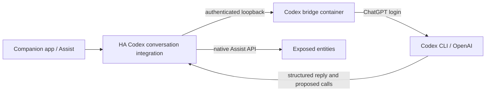

# Codex in Home Assistant

Codex is the default Assist conversation agent. It uses the server's existing
ChatGPT subscription login through Codex CLI 0.154.0. No OpenAI API key or
separately billed OpenAI API project is configured. Requests consume the
account's Codex allowance and need an internet connection. This is a custom
integration maintained in this repository, not an official Home Assistant Codex
integration. Grok/xAI voice was explicitly deferred; no xAI key is installed.

## Use it on the phone or Mac

Open the Home Assistant Companion app connected to this server, or
[assistant.lan](http://assistant.lan), then open **Assist** (the speech-bubble
button). Select **Codex** if the app has remembered a different assistant.
Switch to text input and try:

- “Turn on the Codex demo switch.”
- “Turn it off.”
- “What can you help me with?”

The demo is an `input_boolean` helper and controls no physical equipment.
It was tested through real Codex requests with its HA state checked afterward.
The default pipeline has text input/output. You can use the phone keyboard's
dictation button to enter text. Server speech recognition, spoken replies,
wake words and microphone satellites are not installed. This distinction also
means the Assist microphone button needs a speech pipeline before it can work.
The app must use this server and Tailscale must be connected when away from home.

After adding a real device, go to **Settings → Voice assistants → Expose** and
expose the entities you want Assist to use. Give rooms/devices clear names.
Codex receives the exposed device context and uses Home Assistant's native
Assist tools. The leak sensor still needs its Zigbee coordinator and pairing;
room identity still needs the presence hardware. Codex cannot infer either from
the phone app merely being installed. See [the DIY plan](diy-smart-home.md).

## Architecture and scope



Home Assistant executes tool calls, validates their arguments and applies its
Assist exposure rules. The bridge rejects undeclared tool names and malformed
arguments. It has no Docker socket, projects, media, home directory or Home
Assistant token mounted. Built-in shell, browser, apps, hooks and subagents are
disabled; each request uses a read-only sandbox and an ephemeral session.
The bridge cannot edit server projects or administer Home Assistant. Continue
using `ssh home-server` and `codex` for server/project work.

The container runs as UID/GID 1000 with a read-only root, dropped capabilities,
temporary working directories and its own network. Port 18790 binds to host
loopback only and requires a random bearer token for conversations. The health
endpoint does not make a paid/quota-consuming request. At most two requests run
at once, each with a 120-second timeout; requests needing tools can involve
multiple model calls. Replies can take several seconds or longer. Failed or
timed-out actions are not automatically retried, since their outcome may be
uncertain. Check the entity's state before repeating an important action.

Prompts, device context and tool results are sent to OpenAI using the signed-in
account. Home Assistant keeps its normal conversation/trace state. The bridge
does not log message bodies, provider errors or credentials, and removes its
temporary output files after requests. It retains private CLI runtime state
beside its private auth cache; this state is outside the public checkout.

## Reproduce and maintain

On the server, after the storage/Home Assistant prerequisites in
[creative-storage.md](creative-storage.md):

```sh
codex login status
# If needed, authenticate interactively: codex login --device-auth
make codex-home-start
# Wait for Home Assistant to become healthy, then:
make codex-home-configure
make check-codex-home
make check-server
```

`creative-start` also provisions/builds this bridge. The preparation script
creates a private token and seeds a separate CLI auth directory from the existing
server login only when absent. It never overwrites a refreshed bridge login.
Auth is in `${HOME_SERVER_SECRETS_DIR}/codex-home-auth`, with directory mode 700
and `auth.json` mode 600. The bridge token is a mode-600 Compose secret at
`${HOME_SERVER_SECRETS_DIR}/codex_home_token`. Neither belongs in Git or the Nix
store. Reauthenticate the bridge independently if its login expires:

```sh
docker exec -it codex-home codex login --device-auth
docker exec codex-home codex login status
```

`configure-codex-home.py` uses supported HA login/WebSocket APIs to create or
reconcile the Codex pipeline, make it preferred and expose only the virtual demo
helper explicitly. It preserves speech engines added later in the UI. It uses
the private shared home-services owner password and revokes its temporary
session afterward. If you enable MFA/change the HA password separately, configure
the pipeline in HA's UI instead of bypassing authentication.

`make check-codex-home` tests bridge access/input handling and uses real Codex
requests to toggle the virtual helper on then off. This consumes subscription
allowance. `node --test containers/codex-home/validation.test.mjs` checks rejection
of invented tools and malformed arguments without contacting a provider.

After editing mounted HA files, recreate its container to refresh file mounts;
after editing the bridge, rebuild it. Keep the HA version and custom component
compatible. Pin updates intentionally and rerun the virtual-switch check.
`make backup-home-services` includes the private auth and HA integration/pipeline
state and briefly stops the bridge, HA and File Browser for a consistent backup.
Restore that private state together with the matching repository revision.

Sources: [Codex authentication](https://developers.openai.com/codex/auth/),
[Codex non-interactive use](https://developers.openai.com/codex/noninteractive/),
[Home Assistant LLM/Assist API](https://developers.home-assistant.io/docs/core/llm/).
