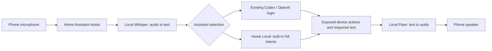

# Local speech for Home Assistant

The owner prefers open-source software and building the system themselves.
Whisper and Piper run on this server in the main Docker Compose project; no
speech API key or new subscription is used. The existing Codex login remains
the selected conversational agent. This is a practical voice pipeline with
separate listening, thinking and speaking stages, not a reproduction of ChatGPT
Voice's continuous audio conversation, expressive delivery or interruption handling.

## Use it

On the phone, open the **Home Assistant Companion app → Assist**, choose
**Codex**, allow microphone access and tap the microphone. Say “Turn on the
Codex demo switch,” then try turning it off. The virtual helper controls no
physical device. Use Tailscale when outside the home. Test with the phone's own
microphone/speaker before adding a satellite or troubleshooting a Bluetooth headset.

Choose **Home Local** in the assistant selector for supported home commands
without sending anything to Codex. It understands HA's built-in command grammar;
it is not a general conversational language model. Both choices only control
entities exposed to Assist. Codex is still the preferred/default pipeline.
Its **Prefer handling commands locally** setting is enabled: supported simple
commands stay in HA, and open-ended questions fall through to Codex. The separate
Home Local option never falls through to a cloud model.
The Codex bridge uses low reasoning effort and asks for short spoken answers to
reduce delays. Local commands can complete much faster than cloud conversation;
voice quality and response timing still need a listening check on the phone.

On iPhone, a shortcut with **Home Assistant → Assist in app** can select the
pipeline and be assigned to the Action Button, Back Tap, Control Center or a
lock-screen control. Use the native Assist action. A plain HTTP browser page
at `assistant.lan` may refuse microphone access because browser recording
requires a secure context; text input still works. Native Companion Assist is
the initial voice client, so no public domain/port forwarding is required.

## Components and data flow



| Component | Deployed selection |
|---|---|
| Speech recognition | Wyoming Whisper 3.8.1, `small.en`, CPU int8, four threads |
| Spoken replies | Wyoming Piper 2.5.2, `en_US-lessac-high`, CPU |
| Language | English initially; `small.en` is an English-only model |
| Codex pipeline | Local speech + existing subscription-backed Codex conversation |
| Home Local pipeline | Local speech + built-in `conversation.home_assistant` |
| Speech network | Internal Docker network; no published LAN ports |

The images are pinned by digest. Models live under
`${SERVER_DATA_DIR}/voice/{whisper,piper}` with SHA-256 manifests. Their files are
ordinary portable caches outside Git. Whisper and Piper run as UID/GID 1000,
with read-only container roots, dropped capabilities and temporary `/tmp`.
They use CPU inference; no GPU capability or CUDA compatibility is assumed.
Memory/CPU limits leave resources for the media stack. A different model needs
a fresh latency/accuracy test on this hardware.

Temporary model-bootstrap containers have outbound access to download the
public models, with no published ports or credentials mounted. Runtime speech
containers use `--local-files-only`, offline mode and an internal Docker
network. They cannot call a speech cloud service. Home Assistant, running on
the host network, connects to the versioned private container addresses in
`server.conf`: Whisper `172.22.0.2:10300`, Piper `172.22.0.3:10200`.
Keep this subnet distinct from physical LAN, VPN and other container networks.
These are server-internal endpoints, not phone addresses.

Speech audio stays on the server, but the **Codex** choice sends the transcript,
conversation context and exposed-device/tool data to OpenAI. **Home Local** uses
no cloud model. HA may retain normal Assist traces and TTS cache files privately;
the services are not configured to archive microphone recordings. Downloaded
model licenses/model cards still apply to their use and redistribution.

## Reproduce, change, verify

After the storage/HA/Codex prerequisites, on the server:

```sh
make voice-start
make check-voice
make check-server
```

`voice-start` downloads and fingerprints model files in temporary containers,
starts the two isolated runtime services, waits for health, then reconciles HA.
Repeated configuration reuses integration entries titled **Home Voice: Whisper**
and **Home Voice: Piper** and updates both Assist pipelines through supported
APIs. The owner password is used only through captured subprocess stdin; its
temporary HA session is revoked. No `.storage` files are hand-edited.

`check-voice` synthesizes test commands, sends actual audio through the Assist
WebSocket protocol, checks the transcript and real virtual-switch state, then
downloads the returned speech audio. It tests Home Local and Codex with on/off
commands, plus an open-ended question through Codex. The question uses Codex
subscription allowance. This synthetic
test does not measure a real person's accent, room noise, phone permissions or
phone-speaker playback. The final listening check is on the phone.

Change `WHISPER_MODEL`, `VOICE_LANGUAGE` or `PIPER_VOICE` in `server.conf`, then
rerun `make voice-start`. When adding languages, select a multilingual Whisper
model and a matching Piper voice. TTS language follows the voice's locale. The current
configuration targets English and is not an automatic multilingual setup.
The synthetic check phrases are English and must also change for another language.
Keep the selected voice/model files and their manifests for an exact recovery;
fresh upstream model downloads may change even though container images are pinned.

In the 2026-09-14 synthetic test, on/off commands returned speech audio in
1.6–1.7 seconds through both pipelines' local path. An open-ended Codex question
took 24 seconds including recognition, the model answer and generated audio.
These are server test samples, not guarantees for real microphone input. Codex
conversation is still noticeably slower than a dedicated realtime voice model.

HA's private integrations, pipeline choices and TTS state are included in
`make backup-home-services`. Model caches are reproducible/downloadable data and
are not included in that app-state archive; copy them separately if offline
recovery matters. No original footage backup policy is changed.

## Build toward a more natural voice interface

The next work is interaction quality: streaming recognized phrases and response
sentences, reliable end-of-turn detection, stopping speech when interrupted,
canceling stale actions, and acoustic echo cancellation. A more expressive
open-source TTS engine such as Kokoro can be evaluated behind the same interface,
with measured latency and listening comparisons before replacing the working
voice. No alternative model or realtime voice service is claimed as installed.

Use the phone first. For a DIY remote, the Pi 4 can host a voice client with a
USB microphone/speaker and a physical push-to-talk button. Exact Pi/Zero model,
audio hardware, battery/power and network access must be identified before
deploying it. This avoids putting microphones throughout the house; room
awareness can use the separate BLE/mmWave plan in [DIY smart home](diy-smart-home.md).

Sources: [Whisper server](https://github.com/OHF-Voice/wyoming-faster-whisper),
[Piper server](https://github.com/OHF-Voice/wyoming-piper),
[HA local voice](https://www.home-assistant.io/voice_control/voice_remote_local_assistant/),
[Wyoming integration](https://www.home-assistant.io/integrations/wyoming/),
[Assist on Apple devices](https://www.home-assistant.io/voice_control/apple/).
