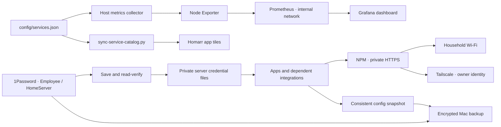

# Registering services without dashboard drift

The source of truth is **[config/services.json](../config/services.json)**.
It drives both Homarr app tiles and Prometheus availability probes. Containers
without browser UIs appear in Grafana, not as broken dashboard links.

## New-service workflow

1. Add reproducible Compose/configuration. Keep backends private and expose a
   password-protected HTTPS route through NPM. Follow [security boundaries](security-hardening.md).
2. Save and read-verify a distinct owner credential in 1Password **before** applying
   it. Use the [password saving flow](security-hardening.md#save-before-changing-an-app).
   If the app authenticates through another service, reference that identity instead.
3. Update integrations and test an actual login through the final HTTPS address.
4. Register the UI and its internal health URL on the Mac:

```sh
python3 scripts/register-service.py \
  --id example --title 'Example' \
  --url https://example.home.egouda.xyz/ \
  --probe-url http://example:8080/health \
  --credential example --category Applications --sync
```

`--sync` sends the catalog to the server, checks all registered URLs, updates
Homarr, and refreshes metrics. Existing app IDs/layouts are preserved. New tiles
are appended in compact rows. Repeating the command updates the same entry; it
does not create duplicate tiles. A private Homarr database snapshot precedes edits.
The script does not deploy the app or bypass the credential/login steps above.

5. Run the required Mac/server checks, plus any app-specific tests. Commit and push
   only your files; fast-forward the server checkout while preserving unrelated work.
   Update this documentation for new dependencies and recovery procedures.

## Fields

| Field | Meaning |
|---|---|
| `id` | Stable lowercase slug; also the Grafana service label |
| `title` | Human-readable Homarr tile title |
| `url` | Household HTTPS browser address, optionally a UI path |
| `probe_url` | Internal Docker URL used by Homarr health checks |
| `credential` | Applied credential key / 1Password item suffix; null for separately managed native identities |
| `category` | Human-readable app grouping description |
| `expected_status` | HTTP responses indicating the endpoint is reachable |

Never put credentials, access-token query strings or authenticated URLs in the
catalog. Hostname aliases should not create duplicate app entries. Add matching
URLs to the same 1Password item when an identity spans sites (e.g. Jellyfin/Requests).

## Dependency graph for future agents



AGENTS.md links the security and registration guides. The catalog records the
service inventory; Compose records actual network/storage dependencies; these
are the maintained graph sources, avoiding a second stale inventory.

## Shared authentication standard

Every new browser route declares an owner/household gateway policy; see
[central authentication](authentication.md) for deployment status and the required
identity adapter contract. Registration defaults to owner-only and the central
`auth` credential. `--sync` will not publish a tile until auth deployment and route
checks succeed. The current inventory includes 35 browser applications.
